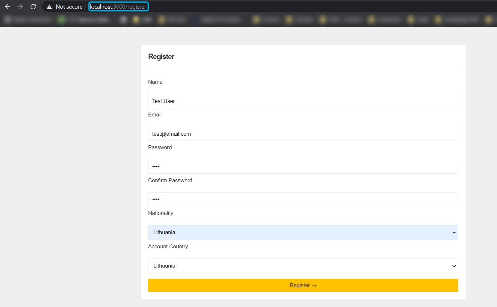
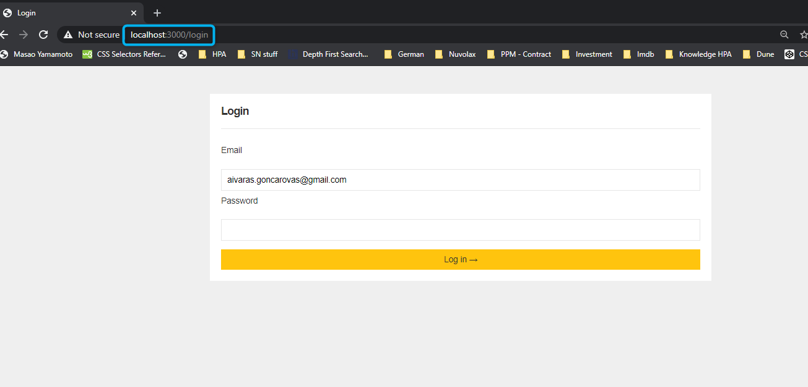
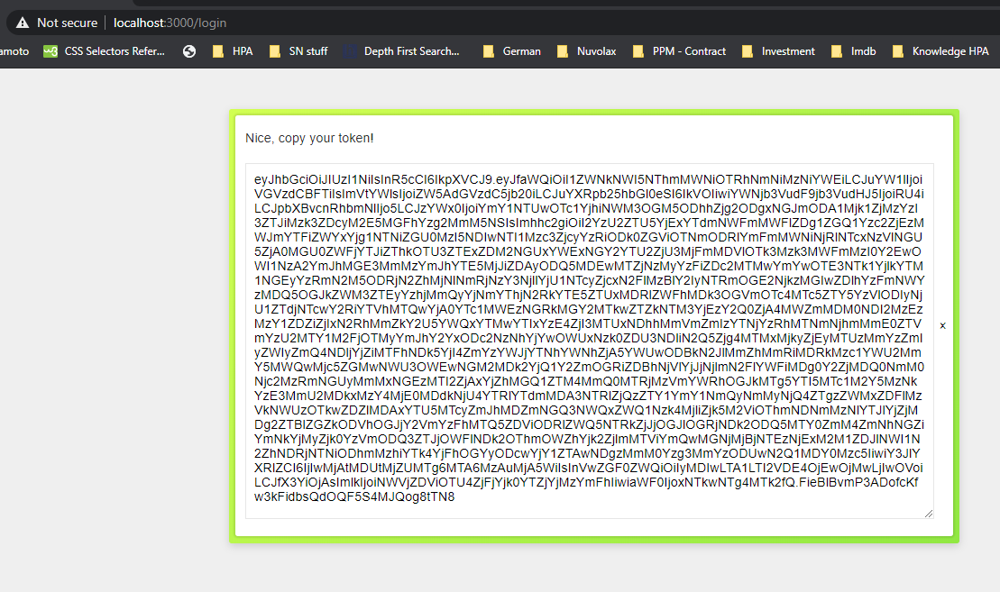

*Teltonika nodejs entry task - All fragile information like secrets, credentials, keys are exposed on purpose!*

# Running the Project
**Without Docker (standard)**

*prerequisites: Node.js(version 10.x or higher recommended) installed*

Steps to run:
1. Navigate to the root of the project
2. Run "npm install"
3. Run "npm start"

Node.js server will start on https://localhost:3000

**With Docker**

*prerequisites: Docker installed*

Steps to run:
1. Navigate to the root of the project
2. Run "docker-compose build"
3. Run "docker-compose up"

Node.js server will start on https://localhost:3000

# Core Features

**Scheduling**

To achieve scheduling of transaction processing [Agenda library was used][2]

There are 4 Jobs running, 2 of them running every 15 minutes and rest running every 1 hour.
List of Jobs ordered from highest to lowest priority:

1. Domestic transactions(e.g LT-LT) from users with importance [0-5] processing (every 15 minutes)
2. International transactions (e.g EN-LT) from users with importance [0-5] processing (every 15 minutes)
3. Domestic transactions(e.g LT-LT) from users with importance [6-10] processing (every 1 hour)
4. International transactions (e.g EN-LT) from users with importance [6-10] processing (every 1 hour)

**API Documentation**

Link below opens API docs, provided collection can be run directly in Postman desktop client.
[API Documentation generated using Postman][1]

*To run provided collection with Postman, desktop client is required.*

**Basic Front-End Views**

Endpoints /register and /login can be accessed via browser.

*/register view*

*/login view*

Both /register and /login returns token, which can be used to access other resources.

[1]: https://documenter.getpostman.com/view/2783029/SztBa7ga?version=latest "API Documentation"
[2]: https://github.com/agenda/agenda "Git Library for managing jobs"

